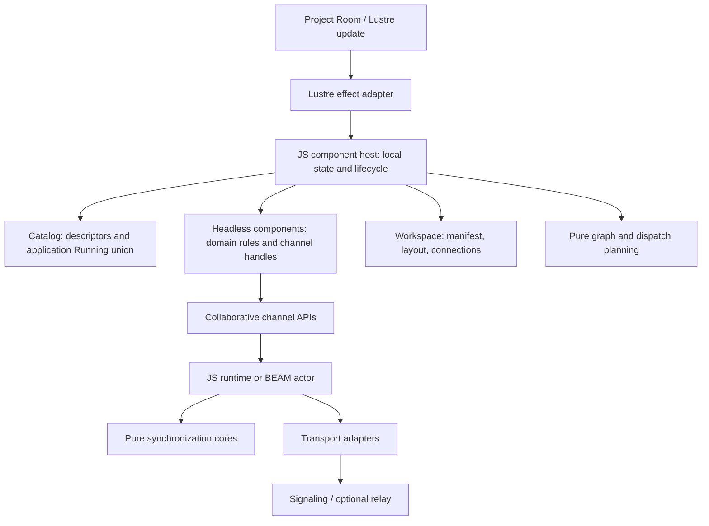

# Watershed through the Gnome Village model

## Executive summary

**Your concern is justified, but I would keep the basic component model.** Watershed separates reusable code, domain state, and orchestration through opaque descriptors, typed ports, pure transitions, and explicit runtime ownership; the Gnome Village essays support this separation.[^1][^2][^5][^6] The clearest component coupling is in application integration, where a shared `Running` union, repeated adapters, a broad context, and host rendering require coordinated edits across several files.[^10][^11][^12] The greater risk is temporal coupling in the JavaScript component host and synchronization runtimes: callback timing, nested calls, or exceptions can disrupt state updates and other work.[^15][^16][^24] I would define and enforce execution and lifecycle rules first, simplify catalog and rendering code next, and add separate processes only for a specific scheduling, recovery, or state-ownership need.[^3][^4]

## Scope and method

This review compares architectures. It does not provide an implementation plan or a complete correctness audit. Six focused investigations covered the original essay and three related articles, component contracts and composition, synchronization runtimes, the JavaScript component host, Lustre integration, and reference-service deployment.

Repository citations refer to commit `122ccbabee9d800c24b2e4d22acf7dd072aae7be`. Researchers reported no working-tree changes to the cited source files. They read the implementation and existing tests but did not run failure reproductions. A failure path identified from the code does not mean the example application has experienced that failure.

| Repository | Role in this comparison |
|---|---|
| [tylerbutler/watershed](https://github.com/tylerbutler/watershed) | Component contracts and execution host, replication cores and runtimes, Lustre adapters, Project Room example, and reference relay/signaling services.[^5][^20][^31] |

## 1. What the analogy asks us to examine

Stenman separates **code**, **processes**, and **domains**. Modules provide reusable behavior. Processes execute that behavior and own private mutable state. Domains define stable APIs and own data and invariants. A module does not need its own process. One process can execute functions from several modules.[^1][^2]

The related articles describe workers, resource owners, routers, gatekeepers, and observers. Stenman warns against mixing responsibilities and allowing failures to affect unrelated work. He does allow coordination: the payments example includes cross-domain orchestration.[^3][^4]

For Watershed, I would apply five questions:

| Question | Evidence that matters |
|---|---|
| Who owns an invariant and its mutable state? | A defined owner and API restrict access to component internals.[^2] |
| What can execute during an operation? | Explicit ordering and completion rules replace assumptions about callback timing.[^1][^4] |
| What happens when an operation fails? | The design limits which work stops and which state must recover.[^1][^4] |
| How much must change to add a domain capability? | Callers depend on a stable contract, not internal representations.[^2] |
| Why does a runtime boundary exist? | The boundary serves a state-ownership, concurrency, admission-control, or recovery need.[^3] |

**A Gleam function call within one owner's responsibility is not an architectural violation.** A queue alone does not provide process isolation, supervision, bounded memory, or overload handling. The BEAM and its deployment model can provide these through separate mechanisms. A JavaScript host needs explicit decisions about each property.[^1][^3][^4]

## 2. Watershed's actual boundaries

The diagram shows responsibilities and data flow. Its boxes do not represent separate processes. It includes both component and synchronization layers, but does not imply that the current component host supports every replication backend.[^5][^7][^13][^20]



### The component is a descriptor, not a process

The complete central descriptor definition is:

```gleam
pub opaque type Descriptor(context, running) {
  Descriptor(
    kind: String,
    version: Int,
    ports: List(port.Descriptor),
    validate_config: fn(Json) -> Result(Nil, ComponentError),
    start: fn(context, Json, fn(Result(running, ComponentError)) -> Nil) -> Nil,
    inputs: List(InputHandler(running)),
    stop: fn(running) -> Result(Nil, ComponentError),
  )
}
```

The descriptor packages behavior and metadata. It does not create a mailbox or a separately supervised executor. The target host stores each instance's `running` value and calls its handlers. Each handler returns replacement local state and output events.[^5][^6]

This distinction follows the original essay. Making each descriptor an actor would tie shared code to a particular executor.[^1]

### Pure planning is a strength

Workspace composition stores manifests, layout, and connections. Pure functions derive a snapshot, validate graph edges, prepare instances, and calculate lifecycle changes. Changes to the graph or layout do not require a restart of unchanged components.[^7][^8]

Similarly, CRDT transitions return explicit effect descriptions:

```gleam
pub type Outcome {
  Outcome(
    broadcast: List(Message),
    reply: List(Message),
    created: List(ChannelDescriptor),
    events: List(#(String, ChannelEvent)),
  )
}
```

The runtime executes those effects. The pure core does not own sockets or call subscribers. This contract separates the responsibilities even when both layers execute in one process.[^20]

## 3. Component coupling: where the concern holds

### 3.1 The shared `Running` type requires edits to add a component kind

The descriptor hides each component's configuration type. However, all descriptors in a catalog share one `context` type and one `running` type. Project Room defines `Running` as:

```gleam
pub type Running {
  TaskCollection(task_collection.Running)
  Inspector(inspector.Running)
  DecisionPoll(decision_poll.Running)
  OwnershipSlots(ownership_slots.Running)
  Notes(notes.Running)
  Activity(activity.Running)
  Checklist(checklist.Running)
  Tally(tally.Running)
}
```

Each nested state can remain opaque. The union therefore does not itself expose component internals. The adapters create the coupling: registration lists, projections, handlers, and cleanup matches list the alternatives. A new variant requires changes to exhaustive matches for existing components.[^5][^10][^11]

For a fixed application, this is a reasonable, type-safe choice. A reusable component SDK has a different requirement: adding a component should require few unrelated edits. The current structure suggests about four production integration files for a simple palette component. A seeded component with connections may require six or seven, plus tests and documentation. These are estimates of the affected files, not measurements of development time.[^11][^12][^14]

**My recommendation:** keep the union until an extension requirement justifies replacing it. First remove repeated adapter logic with existing projections or a small shared adapter pattern. Code generation, dynamic registries, and existential packaging also have maintenance costs. The current evidence does not establish a need for them.[^10][^11]

### 3.2 Rendering is more tightly coupled than the descriptor model suggests

The design document describes an optional nested-MVU adapter that the shell can mount. The example host instead selects component views through a switch on instance IDs and `Running` variants. Several fixed components depend on literal instance IDs. Checklist and Tally support more generic rendering by kind.[^12]

A valid descriptor is therefore not enough to mount a component. UI integration also requires changes to host messages, update handling, and rendering.[^12][^14]

Room Agreement exists outside that eight-kind running catalog. Its domain behavior exists, but the application does not yet integrate it. The evidence does **not** establish that coupling caused the delay.[^39]

**Decision needed:** either keep rendering application-owned and document the required host edits, or implement the promised adapter contract with the next component integration. I would resolve this mismatch before describing the model as a plug-in architecture.[^12]

### 3.3 The common context grants broad access

Project Room's common context contains the document, instance subtree, instance ID, participant identity, invalidation callback, and output emitter. Descriptor adapters select which fields they pass to each component. This limits access within components, but each adapter can access the broader context.[^10]

Port capability strings describe intended access; they do not enforce authorization. Opaque component state can also contain mutable channel handles. Opacity does not make those handles read-only.[^9][^17]

This is acceptable for trusted components within one application. It does not establish sandboxing or enforced isolation between third-party components. Narrow the context according to actual needs. Keep document and channel access when a component needs to resolve channel handles. Do not give components participant or publication capabilities by default when they do not need them.[^9][^10]

### 3.4 Port compatibility becomes a runtime contract after persistence

Direct `port.connect` requires compatible Gleam payload types and matching schema IDs. Persisted connections retain instance and port references. Graph validation then compares metadata without the Gleam payload types, including string schema IDs. Matching IDs do not prove that independently supplied codecs agree.[^9]

The receiver decodes the payload and can reject it with `InvalidInputPayload`. This is a reasonable boundary between typed code and serialized data. Keep persistence and ports. For independently developed components, define schema-ID ownership and versioning rules, and provide examples of the expected contracts.[^6][^9][^4]

## 4. The component host: ownership needs execution rules

The JavaScript host has one mutable state cell. It contains instances, pending starts, failed identities, topology, generation counters, and scheduling flags. The host owns this local execution state and coordinates the components. It does not contain Checklist, Tally, or poll business rules. The evidence therefore does not support calling it a domain-level god object.[^13][^15]

### Existing protections worth retaining

The host uses generation-bound emitters to reject stale asynchronous publications. It cleans up late successful starts and preserves unchanged instances during topology reconciliation. It validates output batches before committing returned local state or dispatching the outputs. Dispatch uses FIFO ordering and schedules each edge at most once per trace.[^8][^18][^19]

Existing tests cover late-start cleanup, stale-emitter rejection, invalid-batch rejection, and topology edits that do not restart instances.[^19]

Output validation has a limit: rejecting returned state and events does not roll back earlier effects through mutable channels. For example, the Checklist completion code mutates its OR-set before it returns an output event.[^15][^23]

### Reentrancy is the strongest ownership concern

The public `command` implementation follows this control flow:

1. Read the runtime state.
2. Invoke the caller-supplied action.
3. Construct and store a replacement from the earlier state.

An action can capture the runtime in a closure and issue a nested command during step 2. The nested call can commit a newer instance dictionary and trace counter. The outer call can then overwrite them with its earlier snapshot. Input delivery has a similar risk, limited to nested updates to the same target.[^15]

This is a **high-confidence finding from the code**, not an observed Project Room incident. The Lustre adapter defers message dispatch, which reduces ordinary UI reentrancy. Other callers can use the public runtime without that adapter.[^15][^22]

During shutdown, the host sets `stopped` after it executes unsubscribe and cleanup callbacks. A callback with access to the runtime may issue a command before that final state update.[^16]

**First architectural correction:** define a run-to-completion policy at the owner. Finish one command before another can change its state. Either reject nested commands with a typed error, or queue them and report completion later. These choices affect the API differently: `command` currently returns a synchronous `Result`. A queue is not a drop-in change. Set a stopping state before calling cleanup callbacks.[^15][^16]

These changes would strengthen state ownership without adding worker threads, a process per component, or a transport protocol.

### Error returns and exceptions have different failure scopes

The host handles ordinary component `Result` failures. It reports downstream delivery failures separately from command acceptance. It does not contain arbitrary exceptions from actions, start and stop handlers, or reporting callbacks. A panic or thrown exception can interrupt dispatch or cleanup.[^15][^16][^17]

Define the failure contract before changing the implementation. For trusted application code, document whether these exceptions invalidate the runtime. For stronger isolation, define how to report the failing instance and complete required cleanup. Continue only where state remains valid. Catching every exception and continuing would conceal incomplete work.

Startup uses generation checks but lacks an explicit one-shot completion guard. A second completion callback can interfere with the accepted generation's emitter. If a start never completes, it can remain pending indefinitely. These cases need lifecycle rules; they do not justify removing the generation design.[^18]

## 5. The Checklist-to-Tally code path preserves domain boundaries

The Checklist completion path shows how components can cooperate without direct calls to each other's mutation functions:

1. The view emits a completion intent.
2. The application routes it through a Lustre effect to a runtime command.
3. Checklist checks the item and its completion state, updates its OR-set, and returns an `item_completed` output.
4. A persisted port connection routes that output to Tally.
5. Tally handles the decoded increment and updates its own PN-counter.[^23]

Checklist does not call Tally's mutation function. The runtime does not decide what completion or counting means. The components communicate through a protocol even though they execute in one JavaScript environment.[^23]

The Lustre helper below separates two steps: execute work in the effect phase, then deliver its outcome to `update`.

```gleam
pub fn perform(
  operation operation: fn() -> result,
  outcome outcome: fn(result) -> msg,
) -> Effect(msg) {
  use dispatch <- effect.from
  let result = operation()
  queue_microtask(fn() { dispatch(outcome(result)) })
}
```

The helper defers outcome delivery. It does not execute the operation in a separate actor.[^22]

## 6. Coupling elsewhere

### 6.1 Synchronization runtimes use different execution boundaries

The BEAM sequenced runtime owns state in an actor. It receives transport work through its mailbox. The JavaScript runtimes use mutable cells and callbacks around pure transition cores. Both approaches can preserve domain boundaries. Only the BEAM runtime provides a process and mailbox boundary here.[^20][^21]

Investigate these three JavaScript timing and failure concerns before a broader refactor:

| Concern | Code-supported path | Qualification |
|---|---|---|
| Subscriber exceptions interrupt sequenced protocol work | The runtime commits inbound core state and calls subscribers before it requests missing operations and performs other effects. A throwing callback can skip that later work.[^24] | The CRDT facade already contains callback exceptions. The runtimes use different policies.[^25] |
| Operations during asynchronous summary loading can remain unapplied | During summary fetch, the JS runtime ignores operations while connecting. It relies on later traffic to expose a sequence gap.[^26] | The code suggests a failure if no later traffic arrives. Researchers did not run a reproduction. |
| Injected transport callbacks can run before handle installation | The sequenced transport and relay driver store their handles after `connect` or `open` returns. A synchronous callback can need the handle before that happens.[^27][^28] | Native asynchronous implementations can hide the issue. The P2P path already buffers early callbacks.[^29] |

These implementations depend on implicit rules: callbacks must wait for initialization, or another message must arrive to trigger recovery. Explicit rules for initialization, completion, and callback order would help more than splitting large files.[^26][^27][^28][^29]

The cores also differ in encapsulation. `crdt_core.Document` is opaque. `runtime_core.Core` exposes sequencing and acknowledgement state through a public constructor. Making `Core` opaque could protect its invariants. Before changing that API, identify the adapters and tests that use the constructor.[^30]

### 6.2 Reference services: room ownership and process isolation differ

Signaling and relay use pure Gleam state machines that return I/O actions. The Node wrappers execute the socket and storage effects. Relay defines its effects as:

```gleam
pub type Action {
  Send(connection: Int, frame: ServerFrame)
  Close(connection: Int, reason: String)
  Append(room: String, line: String)
  Compact(room: String, lines: List(String))
}
```

This contract separates protocol decisions and persistence requirements from the socket implementation.[^31]

The services contain several kinds of failure. Bad protocol traffic normally causes the service to close the offending connection. Relay limits logs, drops slow consumers, and persists data before publishing it. However, all rooms in each service share one Node event loop. Synchronous relay storage pauses the whole service. Under the default startup policy, one corrupt room can prevent the store from opening.[^32][^33][^34]

Compose separates signaling, relay, and TURN. It does not configure automatic restart policies or a healthcheck for the optional relay. The source identifies these as reference services, not production deployments.[^35]

**My interpretation:** this topology is reasonable for a reference implementation. Production requirements may demand that storage delays and failures in one room do not affect other rooms. If so, partition ownership and storage work. Define supervision and single-writer failover. Per-room data structures alone do not provide room-level fault isolation.[^32][^34][^35]

## 7. Priorities

These priorities follow from the evidence. This research did not implement the recommendations.

| Priority | Action | Reason |
|---|---|---|
| **First** | Define how the component host handles nested commands, callback exceptions, and stopping. | These rules determine whether the state owner can preserve state and finish cleanup.[^15][^16][^17] |
| **First** | Investigate the JS summary-load window and make transport startup ordering consistent. | These concerns affect synchronization, regardless of component extensibility.[^26][^27][^28] |
| **Next** | Resolve the difference between the promised rendering adapter and the host implementation. | The design and implementation describe different extension models.[^12] |
| **Next** | Reduce repeated catalog projections and adapters. Grant context capabilities according to need. | This reduces coordinated edits without replacing the type model.[^10][^11] |
| **Next** | Document schema-ID ownership, callback completion, scheduler deferral, and the distinction between command acceptance and delivery errors. | Callers currently need knowledge that these contracts do not fully express.[^9][^15][^18][^38] |
| **Conditional** | Change service process topology or introduce isolated component workers. | Require a specific recovery, untrusted-execution, workload, or latency need.[^3][^34][^35] |

Follow-up acceptance scenarios should cover nested commands during actions, commands during cleanup, and duplicate start completions. Also cover throwing report or subscriber callbacks, synchronous transport callbacks, and an operation received during summary fetch with no later traffic. Existing lifecycle and replication tests provide a starting point. The research did not demonstrate these cases at runtime.[^19][^25][^26][^27][^28]

## 8. What I would preserve

I would preserve the pure cores, effect descriptions, opaque component state, explicit catalog, and typed ports. I would also keep persisted workspace composition, generation-bound publication, local-intent routing, and the thin Lustre adapter. These mechanisms separate domain rules from orchestration. They also let us inspect important behavior without a distributed deployment.[^5][^7][^8][^18][^20][^22][^37]

The Gnome Village analogy does not require microservices, an actor per widget, or a second message bus. I would use it to define **what state ownership guarantees about execution and failure**. Then make the component extension model match the product's promises.[^1][^2][^3][^4]

## Confidence assessment

**High confidence:** researchers traced the following properties in the implementation: descriptors are not actors; each catalog shares `running` and `context` types; the host owns execution state and selects component views. They also confirmed generation-based lifecycle protections, pure protocol and effect contracts, and service-wide process boundaries in the reference deployment.[^5][^10][^12][^13][^18][^31][^35]

**High confidence in code paths, but no observed failures:** a nested command can lose an update; shutdown blocks commands only after cleanup callbacks; exceptions can interrupt later work; callbacks can run before handle installation. The report identifies the conditions for these failures. It does not assume that current application components trigger them.[^15][^16][^24][^27][^28]

**Medium confidence:** the cost of extending the catalog, the need for smaller deployment units, and whether a real transport can trigger the summary-loading failure with no later traffic. These depend on how often developers add components, deployment requirements, and transport behavior.[^11][^14][^26][^35]

**Assumptions and limits:** "our architecture" means the Watershed repository at the cited commit, with emphasis on the component SDK and Project Room example. I assume components are trusted application code unless requirements say otherwise. Researchers read existing tests but did not run them, profile workloads, inject failures, or inspect every FFI boundary. They did not change source code. The original essays describe BEAM systems. Applying their ownership principles to JavaScript does not give JavaScript BEAM isolation or supervision.[^1][^4]

## Footnotes

[^1]: Erik Stenman, [The Gnome Village](https://happihacking.com/blog/posts/2025/the-gnome-village/), 6 November 2025; sections [Shared Scrolls](https://happihacking.com/blog/posts/2025/the-gnome-village/#shared-scrolls), [Mail, Not Shared Drawers](https://happihacking.com/blog/posts/2025/the-gnome-village/#mail-not-shared-drawers), and [Failure Is Contained](https://happihacking.com/blog/posts/2025/the-gnome-village/#failure-is-contained).
[^2]: Erik Stenman, [Domains Own Code and Data](https://happihacking.com/blog/posts/2025/domains-own-code-and-data/), 12 November 2025; sections [What "domain" means here](https://happihacking.com/blog/posts/2025/domains-own-code-and-data/#what-domain-means-here), [Contracts, not processes](https://happihacking.com/blog/posts/2025/domains-own-code-and-data/#contracts-not-processes), and [Spotting and fixing anti-patterns](https://happihacking.com/blog/posts/2025/domains-own-code-and-data/#spotting-and-fixing-anti-patterns).
[^3]: Erik Stenman, [Process Archetypes: The Roles in the Gnome Village](https://happihacking.com/blog/posts/2025/process_archetypes/), 21 November 2025; sections [Resource Owners](https://happihacking.com/blog/posts/2025/process_archetypes/#resource-owners), [Routers](https://happihacking.com/blog/posts/2025/process_archetypes/#routers), [Observers](https://happihacking.com/blog/posts/2025/process_archetypes/#observers), and [Why Roles Matter](https://happihacking.com/blog/posts/2025/process_archetypes/#why-roles-matter).
[^4]: Erik Stenman, [Gnomes, Domains, and Flows: Putting It Together](https://happihacking.com/blog/posts/2025/gnomes-domains-flows-putting-it-together/), 12 November 2025; sections [Payments path walkthrough](https://happihacking.com/blog/posts/2025/gnomes-domains-flows-putting-it-together/#payments-path-walkthrough), [Logging and tracing at the boundaries](https://happihacking.com/blog/posts/2025/gnomes-domains-flows-putting-it-together/#logging-and-tracing-at-the-boundaries), and [Checklist before you ship](https://happihacking.com/blog/posts/2025/gnomes-domains-flows-putting-it-together/#checklist-before-you-ship).
[^5]: [src/watershed/component.gleam:49-113](https://github.com/tylerbutler/watershed/blob/122ccbabee9d800c24b2e4d22acf7dd072aae7be/src/watershed/component.gleam#L49-L113).
[^6]: [src/watershed/component.gleam:211-228](https://github.com/tylerbutler/watershed/blob/122ccbabee9d800c24b2e4d22acf7dd072aae7be/src/watershed/component.gleam#L211-L228) and [src/watershed/component.gleam:299-331](https://github.com/tylerbutler/watershed/blob/122ccbabee9d800c24b2e4d22acf7dd072aae7be/src/watershed/component.gleam#L299-L331).
[^7]: [src/watershed/workspace.gleam:21-66](https://github.com/tylerbutler/watershed/blob/122ccbabee9d800c24b2e4d22acf7dd072aae7be/src/watershed/workspace.gleam#L21-L66), [src/watershed/workspace.gleam:219-259](https://github.com/tylerbutler/watershed/blob/122ccbabee9d800c24b2e4d22acf7dd072aae7be/src/watershed/workspace.gleam#L219-L259), and [src/watershed/workspace.gleam:295-324](https://github.com/tylerbutler/watershed/blob/122ccbabee9d800c24b2e4d22acf7dd072aae7be/src/watershed/workspace.gleam#L295-L324).
[^8]: [src/watershed/component_runtime.gleam:18-130](https://github.com/tylerbutler/watershed/blob/122ccbabee9d800c24b2e4d22acf7dd072aae7be/src/watershed/component_runtime.gleam#L18-L130) and [src/watershed/component_runtime.gleam:166-213](https://github.com/tylerbutler/watershed/blob/122ccbabee9d800c24b2e4d22acf7dd072aae7be/src/watershed/component_runtime.gleam#L166-L213).
[^9]: [src/watershed/port.gleam:13-64](https://github.com/tylerbutler/watershed/blob/122ccbabee9d800c24b2e4d22acf7dd072aae7be/src/watershed/port.gleam#L13-L64), [src/watershed/port.gleam:158-176](https://github.com/tylerbutler/watershed/blob/122ccbabee9d800c24b2e4d22acf7dd072aae7be/src/watershed/port.gleam#L158-L176), and [src/watershed/port_graph.gleam:183-209](https://github.com/tylerbutler/watershed/blob/122ccbabee9d800c24b2e4d22acf7dd072aae7be/src/watershed/port_graph.gleam#L183-L209).
[^10]: [examples/project_room_lustre/src/project_room_lustre/catalog.gleam:25-48](https://github.com/tylerbutler/watershed/blob/122ccbabee9d800c24b2e4d22acf7dd072aae7be/examples/project_room_lustre/src/project_room_lustre/catalog.gleam#L25-L48) and [examples/project_room_lustre/src/project_room_lustre/catalog.gleam:120-166](https://github.com/tylerbutler/watershed/blob/122ccbabee9d800c24b2e4d22acf7dd072aae7be/examples/project_room_lustre/src/project_room_lustre/catalog.gleam#L120-L166).
[^11]: [examples/project_room_lustre/src/project_room_lustre/catalog.gleam:256-285](https://github.com/tylerbutler/watershed/blob/122ccbabee9d800c24b2e4d22acf7dd072aae7be/examples/project_room_lustre/src/project_room_lustre/catalog.gleam#L256-L285), [examples/project_room_lustre/src/project_room_lustre/catalog.gleam:354-462](https://github.com/tylerbutler/watershed/blob/122ccbabee9d800c24b2e4d22acf7dd072aae7be/examples/project_room_lustre/src/project_room_lustre/catalog.gleam#L354-L462), and [examples/project_room_lustre/src/project_room_lustre/catalog.gleam:903-969](https://github.com/tylerbutler/watershed/blob/122ccbabee9d800c24b2e4d22acf7dd072aae7be/examples/project_room_lustre/src/project_room_lustre/catalog.gleam#L903-L969).
[^12]: [docs/superpowers/specs/2026-09-01-data-component-sdk-design.md:155-163](https://github.com/tylerbutler/watershed/blob/122ccbabee9d800c24b2e4d22acf7dd072aae7be/docs/superpowers/specs/2026-09-01-data-component-sdk-design.md#L155-L163) versus [examples/project_room_lustre/src/project_room_lustre.gleam:1055-1129](https://github.com/tylerbutler/watershed/blob/122ccbabee9d800c24b2e4d22acf7dd072aae7be/examples/project_room_lustre/src/project_room_lustre.gleam#L1055-L1129).
[^13]: [src/watershed/component_runtime_js.gleam:114-155](https://github.com/tylerbutler/watershed/blob/122ccbabee9d800c24b2e4d22acf7dd072aae7be/src/watershed/component_runtime_js.gleam#L114-L155) and [src/watershed/component_runtime_js.gleam:370-421](https://github.com/tylerbutler/watershed/blob/122ccbabee9d800c24b2e4d22acf7dd072aae7be/src/watershed/component_runtime_js.gleam#L370-L421).
[^14]: [examples/project_room_lustre/src/project_room_lustre/workspace_setup.gleam:30-55](https://github.com/tylerbutler/watershed/blob/122ccbabee9d800c24b2e4d22acf7dd072aae7be/examples/project_room_lustre/src/project_room_lustre/workspace_setup.gleam#L30-L55), [examples/project_room_lustre/src/project_room_lustre.gleam:443-466](https://github.com/tylerbutler/watershed/blob/122ccbabee9d800c24b2e4d22acf7dd072aae7be/examples/project_room_lustre/src/project_room_lustre.gleam#L443-L466), and [examples/project_room_lustre/src/project_room_lustre/views.gleam:738-807](https://github.com/tylerbutler/watershed/blob/122ccbabee9d800c24b2e4d22acf7dd072aae7be/examples/project_room_lustre/src/project_room_lustre/views.gleam#L738-L807).
[^15]: [src/watershed/component_runtime_js.gleam:250-298](https://github.com/tylerbutler/watershed/blob/122ccbabee9d800c24b2e4d22acf7dd072aae7be/src/watershed/component_runtime_js.gleam#L250-L298) and [src/watershed/component_runtime_js.gleam:853-923](https://github.com/tylerbutler/watershed/blob/122ccbabee9d800c24b2e4d22acf7dd072aae7be/src/watershed/component_runtime_js.gleam#L853-L923).
[^16]: [src/watershed/component_runtime_js.gleam:301-349](https://github.com/tylerbutler/watershed/blob/122ccbabee9d800c24b2e4d22acf7dd072aae7be/src/watershed/component_runtime_js.gleam#L301-L349).
[^17]: [src/watershed/component_runtime_js.gleam:217-260](https://github.com/tylerbutler/watershed/blob/122ccbabee9d800c24b2e4d22acf7dd072aae7be/src/watershed/component_runtime_js.gleam#L217-L260) and [src/watershed/component_runtime_js.gleam:938-960](https://github.com/tylerbutler/watershed/blob/122ccbabee9d800c24b2e4d22acf7dd072aae7be/src/watershed/component_runtime_js.gleam#L938-L960).
[^18]: [src/watershed/component_runtime_js.gleam:462-575](https://github.com/tylerbutler/watershed/blob/122ccbabee9d800c24b2e4d22acf7dd072aae7be/src/watershed/component_runtime_js.gleam#L462-L575) and [src/watershed/component_runtime_js.gleam:684-775](https://github.com/tylerbutler/watershed/blob/122ccbabee9d800c24b2e4d22acf7dd072aae7be/src/watershed/component_runtime_js.gleam#L684-L775).
[^19]: [test/watershed/component_runtime_js_test.gleam:363-593](https://github.com/tylerbutler/watershed/blob/122ccbabee9d800c24b2e4d22acf7dd072aae7be/test/watershed/component_runtime_js_test.gleam#L363-L593).
[^20]: [src/watershed/crdt_core.gleam:173-186](https://github.com/tylerbutler/watershed/blob/122ccbabee9d800c24b2e4d22acf7dd072aae7be/src/watershed/crdt_core.gleam#L173-L186), [src/watershed/crdt_js.gleam:408-477](https://github.com/tylerbutler/watershed/blob/122ccbabee9d800c24b2e4d22acf7dd072aae7be/src/watershed/crdt_js.gleam#L408-L477), and [src/watershed/runtime.gleam:310-345](https://github.com/tylerbutler/watershed/blob/122ccbabee9d800c24b2e4d22acf7dd072aae7be/src/watershed/runtime.gleam#L310-L345).
[^21]: [src/watershed/runtime_beam.gleam:1-36](https://github.com/tylerbutler/watershed/blob/122ccbabee9d800c24b2e4d22acf7dd072aae7be/src/watershed/runtime_beam.gleam#L1-L36) and [src/watershed/runtime_beam.gleam:1013-1024](https://github.com/tylerbutler/watershed/blob/122ccbabee9d800c24b2e4d22acf7dd072aae7be/src/watershed/runtime_beam.gleam#L1013-L1024).
[^22]: [watershed_lustre/src/watershed_lustre/component_runtime.gleam:34-100](https://github.com/tylerbutler/watershed/blob/122ccbabee9d800c24b2e4d22acf7dd072aae7be/watershed_lustre/src/watershed_lustre/component_runtime.gleam#L34-L100).
[^23]: [examples/project_room_lustre/src/project_room_lustre.gleam:786-830](https://github.com/tylerbutler/watershed/blob/122ccbabee9d800c24b2e4d22acf7dd072aae7be/examples/project_room_lustre/src/project_room_lustre.gleam#L786-L830), [examples/project_room_lustre/src/project_room_lustre/checklist.gleam:310-325](https://github.com/tylerbutler/watershed/blob/122ccbabee9d800c24b2e4d22acf7dd072aae7be/examples/project_room_lustre/src/project_room_lustre/checklist.gleam#L310-L325), [examples/project_room_lustre/src/project_room_lustre/catalog.gleam:298-305](https://github.com/tylerbutler/watershed/blob/122ccbabee9d800c24b2e4d22acf7dd072aae7be/examples/project_room_lustre/src/project_room_lustre/catalog.gleam#L298-L305), and [examples/project_room_lustre/src/project_room_lustre/catalog.gleam:972-1023](https://github.com/tylerbutler/watershed/blob/122ccbabee9d800c24b2e4d22acf7dd072aae7be/examples/project_room_lustre/src/project_room_lustre/catalog.gleam#L972-L1023).
[^24]: [src/watershed/runtime.gleam:2445-2474](https://github.com/tylerbutler/watershed/blob/122ccbabee9d800c24b2e4d22acf7dd072aae7be/src/watershed/runtime.gleam#L2445-L2474), [src/watershed/runtime.gleam:2963-3007](https://github.com/tylerbutler/watershed/blob/122ccbabee9d800c24b2e4d22acf7dd072aae7be/src/watershed/runtime.gleam#L2963-L3007), and [src/watershed/runtime.gleam:3035-3043](https://github.com/tylerbutler/watershed/blob/122ccbabee9d800c24b2e4d22acf7dd072aae7be/src/watershed/runtime.gleam#L3035-L3043).
[^25]: [src/watershed/crdt_js.gleam:917-946](https://github.com/tylerbutler/watershed/blob/122ccbabee9d800c24b2e4d22acf7dd072aae7be/src/watershed/crdt_js.gleam#L917-L946), [src/watershed/crdt_js.gleam:2904-2920](https://github.com/tylerbutler/watershed/blob/122ccbabee9d800c24b2e4d22acf7dd072aae7be/src/watershed/crdt_js.gleam#L2904-L2920), and [test/watershed/crdt_js_test.gleam:1641-1667](https://github.com/tylerbutler/watershed/blob/122ccbabee9d800c24b2e4d22acf7dd072aae7be/test/watershed/crdt_js_test.gleam#L1641-L1667).
[^26]: [src/watershed/runtime.gleam:2284-2290](https://github.com/tylerbutler/watershed/blob/122ccbabee9d800c24b2e4d22acf7dd072aae7be/src/watershed/runtime.gleam#L2284-L2290), [src/watershed/runtime.gleam:2355-2425](https://github.com/tylerbutler/watershed/blob/122ccbabee9d800c24b2e4d22acf7dd072aae7be/src/watershed/runtime.gleam#L2355-L2425), and [src/watershed/runtime.gleam:2436-2481](https://github.com/tylerbutler/watershed/blob/122ccbabee9d800c24b2e4d22acf7dd072aae7be/src/watershed/runtime.gleam#L2436-L2481).
[^27]: [src/watershed/runtime.gleam:120-139](https://github.com/tylerbutler/watershed/blob/122ccbabee9d800c24b2e4d22acf7dd072aae7be/src/watershed/runtime.gleam#L120-L139), [src/watershed/runtime.gleam:310-345](https://github.com/tylerbutler/watershed/blob/122ccbabee9d800c24b2e4d22acf7dd072aae7be/src/watershed/runtime.gleam#L310-L345), and [src/watershed/runtime.gleam:2198-2225](https://github.com/tylerbutler/watershed/blob/122ccbabee9d800c24b2e4d22acf7dd072aae7be/src/watershed/runtime.gleam#L2198-L2225).
[^28]: [src/watershed/crdt_sequencer_js.gleam:303-395](https://github.com/tylerbutler/watershed/blob/122ccbabee9d800c24b2e4d22acf7dd072aae7be/src/watershed/crdt_sequencer_js.gleam#L303-L395), [src/watershed/crdt_sequencer_js.gleam:495-521](https://github.com/tylerbutler/watershed/blob/122ccbabee9d800c24b2e4d22acf7dd072aae7be/src/watershed/crdt_sequencer_js.gleam#L495-L521), and [src/watershed/crdt_js.gleam:1367-1428](https://github.com/tylerbutler/watershed/blob/122ccbabee9d800c24b2e4d22acf7dd072aae7be/src/watershed/crdt_js.gleam#L1367-L1428).
[^29]: [src/watershed/crdt_js.gleam:486-494](https://github.com/tylerbutler/watershed/blob/122ccbabee9d800c24b2e4d22acf7dd072aae7be/src/watershed/crdt_js.gleam#L486-L494), [src/watershed/crdt_js.gleam:1046-1062](https://github.com/tylerbutler/watershed/blob/122ccbabee9d800c24b2e4d22acf7dd072aae7be/src/watershed/crdt_js.gleam#L1046-L1062), and [src/watershed/p2p_transport_js.gleam:585-604](https://github.com/tylerbutler/watershed/blob/122ccbabee9d800c24b2e4d22acf7dd072aae7be/src/watershed/p2p_transport_js.gleam#L585-L604).
[^30]: [src/watershed/crdt_core.gleam:98-120](https://github.com/tylerbutler/watershed/blob/122ccbabee9d800c24b2e4d22acf7dd072aae7be/src/watershed/crdt_core.gleam#L98-L120) and [src/watershed/runtime_core.gleam:64-143](https://github.com/tylerbutler/watershed/blob/122ccbabee9d800c24b2e4d22acf7dd072aae7be/src/watershed/runtime_core.gleam#L64-L143).
[^31]: [src/watershed/crdt_signaling.gleam:483-506](https://github.com/tylerbutler/watershed/blob/122ccbabee9d800c24b2e4d22acf7dd072aae7be/src/watershed/crdt_signaling.gleam#L483-L506), [src/watershed/crdt_relay.gleam:427-442](https://github.com/tylerbutler/watershed/blob/122ccbabee9d800c24b2e4d22acf7dd072aae7be/src/watershed/crdt_relay.gleam#L427-L442), and [src/watershed/crdt_relay.gleam:1298-1365](https://github.com/tylerbutler/watershed/blob/122ccbabee9d800c24b2e4d22acf7dd072aae7be/src/watershed/crdt_relay.gleam#L1298-L1365).
[^32]: [src/watershed/crdt_relay.gleam:972-1066](https://github.com/tylerbutler/watershed/blob/122ccbabee9d800c24b2e4d22acf7dd072aae7be/src/watershed/crdt_relay.gleam#L972-L1066), [src/watershed/crdt_signaling.gleam:430-446](https://github.com/tylerbutler/watershed/blob/122ccbabee9d800c24b2e4d22acf7dd072aae7be/src/watershed/crdt_signaling.gleam#L430-L446), and [tools/relay/server.mjs:616-753](https://github.com/tylerbutler/watershed/blob/122ccbabee9d800c24b2e4d22acf7dd072aae7be/tools/relay/server.mjs#L616-L753).
[^33]: [src/watershed/crdt_relay.gleam:1699-1857](https://github.com/tylerbutler/watershed/blob/122ccbabee9d800c24b2e4d22acf7dd072aae7be/src/watershed/crdt_relay.gleam#L1699-L1857), [tools/relay/server.mjs:693-753](https://github.com/tylerbutler/watershed/blob/122ccbabee9d800c24b2e4d22acf7dd072aae7be/tools/relay/server.mjs#L693-L753), and [src/watershed/crdt_signaling.gleam:483-558](https://github.com/tylerbutler/watershed/blob/122ccbabee9d800c24b2e4d22acf7dd072aae7be/src/watershed/crdt_signaling.gleam#L483-L558).
[^34]: [tools/relay/server.mjs:414-472](https://github.com/tylerbutler/watershed/blob/122ccbabee9d800c24b2e4d22acf7dd072aae7be/tools/relay/server.mjs#L414-L472) and [tools/relay/server.mjs:533-570](https://github.com/tylerbutler/watershed/blob/122ccbabee9d800c24b2e4d22acf7dd072aae7be/tools/relay/server.mjs#L533-L570).
[^35]: [docker-compose.p2p.yml:30-55](https://github.com/tylerbutler/watershed/blob/122ccbabee9d800c24b2e4d22acf7dd072aae7be/docker-compose.p2p.yml#L30-L55), [tools/signaling/server.mjs:1-7](https://github.com/tylerbutler/watershed/blob/122ccbabee9d800c24b2e4d22acf7dd072aae7be/tools/signaling/server.mjs#L1-L7), and [tools/relay/server.mjs:9-16](https://github.com/tylerbutler/watershed/blob/122ccbabee9d800c24b2e4d22acf7dd072aae7be/tools/relay/server.mjs#L9-L16).
[^37]: [src/watershed/dispatch.gleam:76-147](https://github.com/tylerbutler/watershed/blob/122ccbabee9d800c24b2e4d22acf7dd072aae7be/src/watershed/dispatch.gleam#L76-L147).
[^38]: [src/watershed/transport_js.gleam:98-118](https://github.com/tylerbutler/watershed/blob/122ccbabee9d800c24b2e4d22acf7dd072aae7be/src/watershed/transport_js.gleam#L98-L118) and [src/watershed/transport_ffi.mjs:104-122](https://github.com/tylerbutler/watershed/blob/122ccbabee9d800c24b2e4d22acf7dd072aae7be/src/watershed/transport_ffi.mjs#L104-L122).
[^39]: [examples/project_room_lustre/src/project_room_lustre/room_agreement.gleam:23-53](https://github.com/tylerbutler/watershed/blob/122ccbabee9d800c24b2e4d22acf7dd072aae7be/examples/project_room_lustre/src/project_room_lustre/room_agreement.gleam#L23-L53) and [examples/project_room_lustre/src/project_room_lustre/room_agreement.gleam:360-400](https://github.com/tylerbutler/watershed/blob/122ccbabee9d800c24b2e4d22acf7dd072aae7be/examples/project_room_lustre/src/project_room_lustre/room_agreement.gleam#L360-L400); compare the catalog registration at footnote 11.
